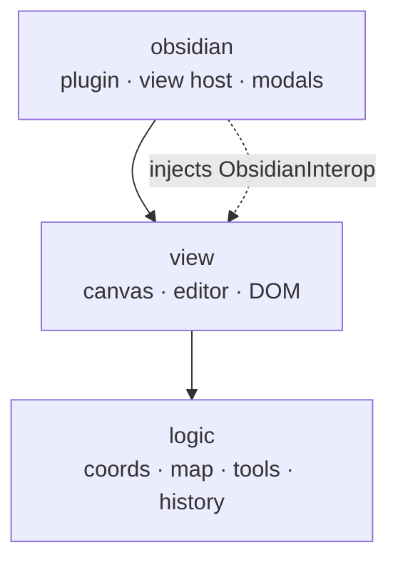

# Three one-directional layers with an injected host port

The code is split into three layers with a strict one-directional dependency rule, enforced by `eslint-plugin-boundaries`:

- **`logic`** — pure domain: coordinates, map data, tools, history. Depends on nothing else.
- **`view`** — canvas rendering, editor components, DOM. Depends on `logic`.
- **`obsidian`** — the plugin, view host, modals. Depends on `view` and `logic`.

`logic` and `view` never import the `obsidian` npm package or the `obsidian` layer. When the view needs the host (open a modal, preview a note, navigate a link), it calls back through the injected **`ObsidianInterop`** port, an interface of plain function types the `obsidian` layer supplies. This keeps `logic` and `view` unit-testable without an Obsidian runtime.

## Consequences

The boundary lint is currently misconfigured: the middle layer's pattern points at a non-existent `src/view/rendering`, so every file under `src/view` is unclassified and the `view` rules never fire. One violation has already slipped through (`ObsidianInterop.ts` imports from the `obsidian` layer). Fixing the config, and deciding whether `ObsidianInterop` becomes a documented exception, is tracked in [#65](https://github.com/JoelJansenD/obsidian-hexer/issues/65). This ADR describes the intended boundary.
