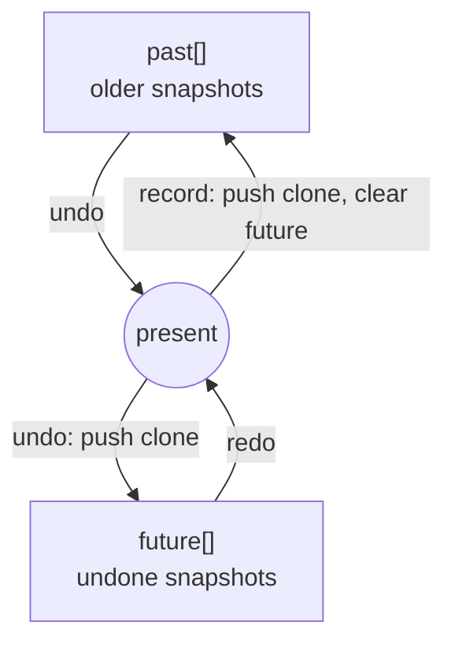

# Undo/redo by whole-map snapshots

`EditHistory` implements undo/redo by cloning the entire `HexerData` on every committed edit (`past` and `future` stacks of full snapshots) rather than a command/diff log. Snapshots are trivial to reason about and match the plain-data model (a snapshot is just a `structuredClone`), at the cost of memory proportional to map size × history depth.

History is intentionally **uncapped** for now. If memory ever becomes a problem, the escape hatch is a command/event ("saga") log, not a cap on snapshots.

Two refinements:

- **Stroke coalescing.** Every commit within one pointer gesture shares a `stroke` symbol, so a whole brush drag collapses to a single undo step. A new or absent key opens a fresh entry.
- **Camera is in the document but not in history.** The camera lives inside `HexerData` so it persists, but panning does not record a history entry. Undo/redo restores the snapshot's camera to bring the reverted change back into view, rather than treating pans as their own undo steps.
