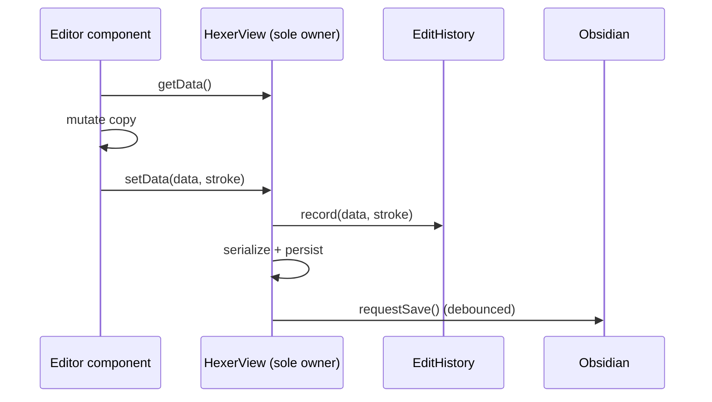

# Single-writer editor data flow

The view (`HexerView`) is the single owner of the canonical `HexerData`. Editor components never hold their own copy: they read the map through a `getData` callback, mutate, and commit through `setData`. `setData` records the edit in history and persists the note; nothing else writes the map. This keeps every change flowing through one seam, where history and saving live.

## Consequences

The ownership model is settled; its current implementation is not yet tuned. Today a single edit performs several full-map clones (read, history, render) and re-serializes the whole map on every commit, wasteful during a drag. Two optimizations are tracked without disturbing the model: collapsing the redundant clones ([#62](https://github.com/JoelJansenD/obsidian-hexer/issues/62)) and moving serialization to the lazy `getViewData` save seam ([#64](https://github.com/JoelJansenD/obsidian-hexer/issues/64)).
