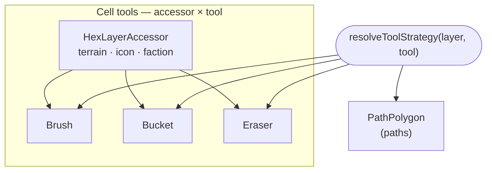

# Tools as strategies over (tool × layer)

Each editing tool is a `ToolStrategy` resolved from the active `(layer, tool)` pair. The three cell tools — brush, bucket, eraser — are **data-driven**: they are generated over a list of `HexLayerAccessor`s (terrain, icon, faction), each of which knows how to apply, clear, and compare one layer of a hex. Adding a new paintable layer is therefore data (a new accessor), not three new tool classes.

The polygon tool that edits paths is a bespoke strategy, because paths are a node/edge graph rather than a per-hex layer (see [ADR 0008](./0008-path-graph-model.md)).

## Consequences

Resolution currently instantiates throwaway strategies to read their static `tool`/`layers` metadata. It is cheap at this scale and left as-is; a descriptor registry could avoid the instantiation later if it matters.
