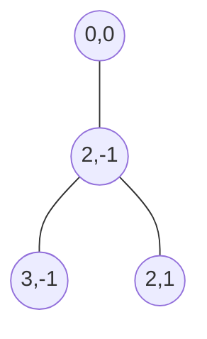

# Paths as node/edge graphs; rivers and roads kept parallel

A path (river or road) is a graph: `nodes` keyed by hex coordinate, joined by **undirected** `edges`. An edge is drawn as a wavy line following the straight hex line between its two endpoints, so a sparse set of nodes yields a continuous route.

Rivers and roads share the identical `Path` structure and are stored in two parallel arrays (`rivers`, `roads`). They have no functional difference in the current model (only their rendering differs), so they are kept separate rather than unified under a `type` field, pending any future divergence.

## Consequences

Node identity is currently the hex coordinate (the node's key), so moving a node is a rekey that must patch every incident edge, a place dangling-reference bugs can hide. Switching to stable node ids is tracked in [#61](https://github.com/JoelJansenD/obsidian-hexer/issues/61).
